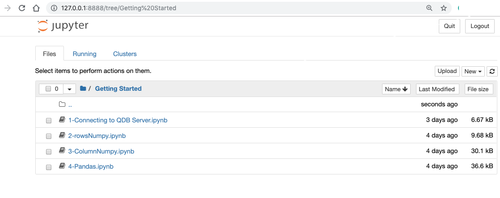

# Jupyter notebooks samples for QuasarDB

This set of notebooks has been tested using latest QuasarDB version and here to help you get acquainted with QuasarDB

If you have samples you would like to add please submit pull requests!

## Python notebooks
The set of notebooks demonstrate use cases of the QuasarDB

The "Getting Started" section regrouping base functionality samples

The "finance samples" demonstrate how to use QuasarDB to persist financial market data and how to retrieve it either plain or transformed (bars)

### Building docker image to run samples
The Docker file at the root of this project derives from jupyter/scipy-notebook

We added to the image the relevant packages to run all our samples, including the latest QuasarDB API version

To build the image clone our repositoriry, go in the directory and type:

    docker build -t bureau14/scipy:0.0 .

You will also need QuasarDB server

    docker pull bureau14/qdb

Run first the  QuasarDb server

    docker run -it -p 2836:2836   -e QDB_DISABLE_SECURITY=true --name qdb-server bureau14/qdb

Then run the image just built

    docker run -it --link qdb-server:qdb-server bureau14/scipy:0.0

You should be prompted to copy paste a link in your browser to access the jupyter notebook server

You should now see our sample notebooks

